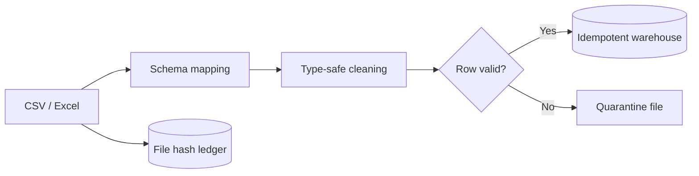

# Schema-Aware File Ingestion

A config-driven ingestion framework for inconsistent CSV and Excel feeds. It standardizes source columns, preserves text identifiers, validates business-critical fields, quarantines bad rows and prevents duplicate file processing.

> This is an original portfolio project built with synthetic data. It contains no employer code, credentials, customer records or proprietary carrier layouts.



## What it demonstrates

- Alias-based mapping from source-specific headers to a canonical model
- Text-safe policy and agent identifiers, including leading zeros
- Defensive parsing for dates, currency, negatives and empty values
- Row-level rejection reasons and quarantine output
- Deterministic record keys and latest-row deduplication
- SHA-256 source-file tracking for safe reruns
- SQLite upserts for a fully runnable local example
- CSV, XLSX and XLSM support
- Automated tests and GitHub Actions CI

## Quick start

```bash
python -m venv .venv
source .venv/bin/activate
python -m pip install -e ".[dev]"

ingest-file sample_data/synthetic_commissions.csv \
  --mapping config/carrier_example.json \
  --database ingestion.db
```

Expected first-run result:

```json
{
  "source_rows": 6,
  "accepted_rows": 3,
  "rejected_rows": 2,
  "deduplicated_rows": 1,
  "skipped": false
}
```

Running the same unchanged file again returns `"skipped": true` because its successful SHA-256 hash already exists in the processing ledger.

## Adapting a new source

Create a mapping file that lists the accepted aliases for each canonical field:

```json
{
  "columns": {
    "policy_id": ["policy number", "contract id"],
    "payment_date": ["paid date", "statement date"],
    "payment_amount": ["commission", "payment"]
  },
  "required": ["policy_id", "payment_date", "payment_amount"]
}
```

The core pipeline remains unchanged as source layouts evolve.

## Production adaptation

Replace the local filesystem with Azure Blob Storage or SFTP, persist the ledger and curated target in PostgreSQL or Azure SQL, and invoke the pipeline through Azure Data Factory, Databricks Workflows or an Azure Function.

## Author

[Dhananjay Panchal](https://dhananjay-panchal.github.io/) — Azure Data Engineer

